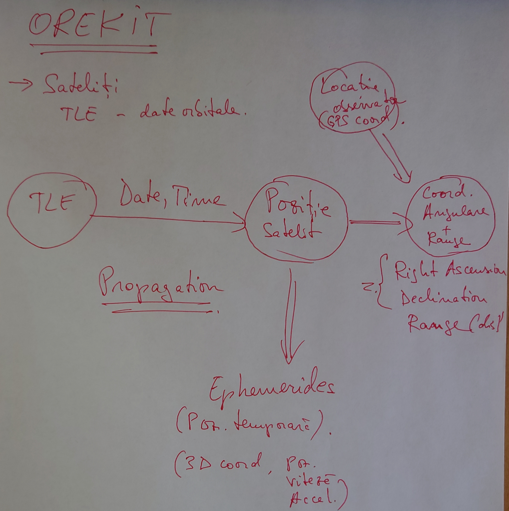

# SatPred

Computes satellite Right Ascension / Declination and Earth-Centered-Fixed (ECF)
position for an observer, from TLE orbital data and a set of timestamps. Built on
[OREKIT](https://www.orekit.org/).

---

## Requirements
- Java 8+ (the project is compiled with `--release 8` and stays Java 8 compatible)
- An `orekit-data` directory (ephemerides, EOP, leap seconds). Get it from
  <https://gitlab.orekit.org/orekit/orekit-data>.

## Usage

```shell
java -jar satpred.jar <tle-file> <input-file> [observatory-name]
```

- `param 1` — TLE file (2- or 3-line element sets). Invalid TLEs are logged and skipped.
- `param 2` — Input location + timestamps file (see format below)
- `param 3` — Observatory name (optional)

The `orekit-data` directory is located via the `OREKIT_DATA` environment variable,
or `./orekit-data` relative to the working directory if the variable is unset.

```shell
OREKIT_DATA=/path/to/orekit-data java -jar satpred.jar tle.txt input.txt Cluj
```

### Build

```shell
gradle jar          # produces build/libs/satpred-<version>.jar
gradle test         # run unit tests
```

## Input file format
First line is the observer location; every subsequent line is a timestamp (UTC).

```
latitude,longitude,altitude            # degrees, degrees, metres
year,month,day,hour,minutes,seconds
year,month,day,hour,minutes,seconds
...
```

## Output format
CSV written to `satpred_output.txt`, one row per TLE × timestamp:

```
tleIndex,timestampIndex,RA[deg],Dec[deg],ecfX[m],ecfY[m],ecfZ[m]
```

A separate run log is written to `satpred.log`.

## Current tasks
- Add a status / progress bar for the CLI app
- Implement azimuth/elevation output (`AzElService`)

## Concept


