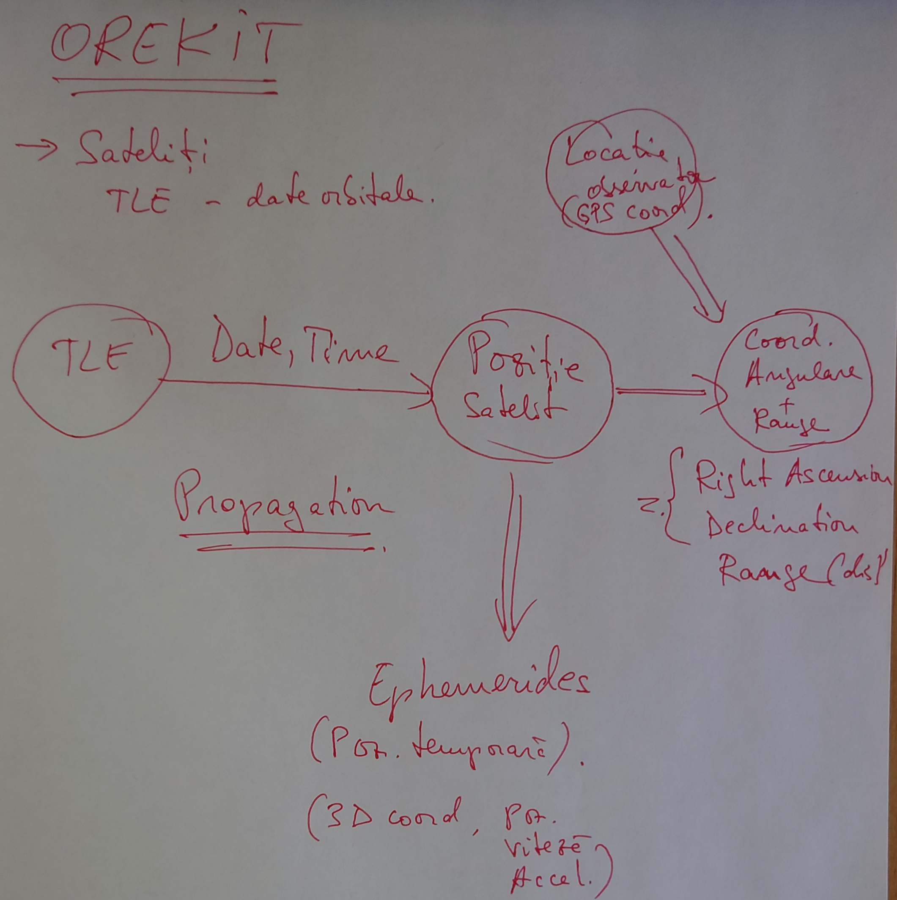

# SatPred

---

## Suggested useage
Have the `orekit-data` directory in the same directory as the executable

```shell
$ java -jar 
```

## Current tasks

- Add additional exception handling for OREKIT internal errors
- Add logging framework to project in order to generate a separate log file
- Add a status / progress bar for the CLI app

## Concept

